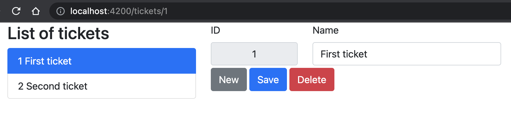

# Angular Clean Architecture

This project aims to be a neat skeleton for a [clean architecture](https://blog.cleancoder.com/uncle-bob/2012/08/13/the-clean-architecture.html) implemented with Angular.

This example shows a management of tickets, each of them having an id and a name.

Tests are done with [Jest](https://jestjs.io/) and [Spectator](https://ngneat.github.io/spectator/), and with [Cypress.io](https://www.cypress.io/).

If you have any suggestions to improve this skeleton, feel free to open an [Issue](https://github.com/pierresh/angular-clean-architecture/issues/new) or a *Pull request* :)

## Advantages
- fully tested (ideally through a TDD approach)
- the front-end can be developed without APIs/back-end thanks to the [in-memory service](https://github.com/pierresh/angular-clean-architecture/blob/main/src/app/domain/tickets/ticket.service.mock.ts)
- the code is divided by layer, one by concern
- the business logic is independent of the component, so it is easy to update the UI without impacting the business logic or to share it between a web app and a mobile app

## Rationale
- domain files are agnostic (does not depend on anything except rxjs) and gathered in one folder per topic in [src/app/domain](https://github.com/pierresh/angular-clean-architecture/tree/main/src/app), including:
    - model.ts
    - usecase.ts
    - state.ts
    - port.ts (just an interface for the services)
- the component interacts only with the use case class
- for the sake of simplicity, the use case class gathers the different use cases for that topic
- unit tests are performed only through the use cases (as they will use the necessary files to perform the required actions, so it is enough to assert their behavior)
- services are in [src/app/adapters](https://github.com/pierresh/angular-clean-architecture/tree/main/src/app/adapters/tickets)
- integration tests are performed on the component and the HTTP service
- 2 services are provided, the original one using HttpClient, and an in-memory one for mock (used by default)

## Development server
Run `npm i` to install dependencies.

Then `ng serve --open` for a dev server.

## Running unit tests

Run `jest src/*` to execute the unit tests

## Running e2e tests

Run `ng e2e` to execute the end-to-end tests

